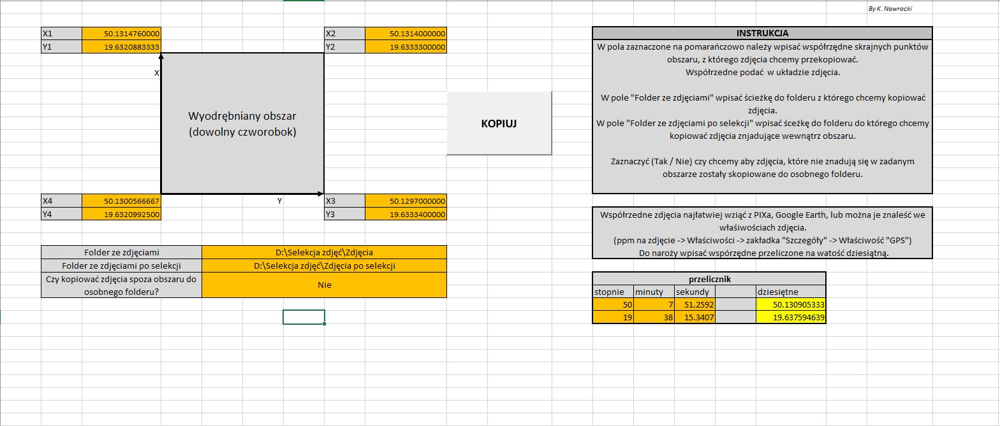

# VBA_Drone_photos_selection
Excel Visual Basic (VBA) Macro - extract photos created in specific localization  

### About
User interface to extract photos with the push of a button utilizing VBA scripting.  
Copies photo created inside quadrangle with the corners coordinates meets the conditions specified by the user (coordinate range) to a new file.

### Imput file
JPG photo files (tested with photo made by DJI Phantom 4 camera)  
example photo <a href='https://github.com/krzysieknaw/VBA_Drone_photos_selection/blob/main/data/101_0368_0257.JPG'> HERE </a>

### Screenshots
#### User Interface

